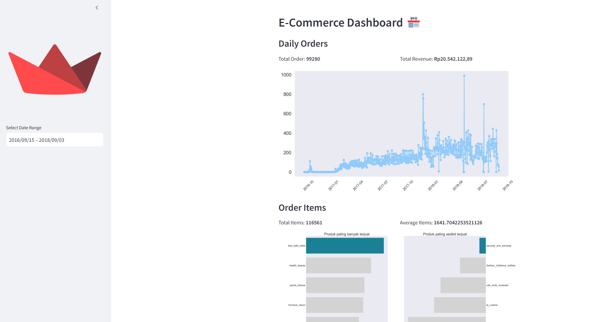

# Submission Dicoding "Belajar Data Analytics dengan Python"

## Project Data Analytics

Repository ini berisi proyek data analytics yang saya kerjakan. Deployment in **Streamlit** 

## Deskripsi

Proyek ini bertujuan untuk menganalisis data pada E-Commerce Public Dataset. Tujuan akhirnya adalah untuk menghasilkan wawasan dan informasi yang berguna dari data yang dianalisis.

## Struktur Direktori

- **/data**: Direktori ini berisi data yang digunakan dalam proyek, dalam format .csv .
- **/dashboard**: Direktori ini berisi main.py yang digunakan untuk membuat dashboard hasil analisis data.
- **Proyek_Analisis_Data.ipynb**: File ini yang digunakan untuk melakukan analisis data.

## Instalasi

1. Clone repository ini ke komputer lokal Anda menggunakan perintah berikut:

   ```shell
   git clone https://github.com/rizqanafiah/dicoding.git
   ```

2. Pastikan Anda memiliki lingkungan Python yang sesuai dan pustaka-pustaka yang diperlukan. Anda dapat menginstal pustaka-pustaka tersebut dengan menjalankan perintah berikut:

   ```shell
   pip install streamlit
   pip install -r dashboard/requirements.txt
   ```

## Penggunaan

1. Masuk ke direktori proyek (Local):

   ```shell
   cd dicoding/dashboard/
   streamlit run dashboard.py
   ```
Atau bisa dengan kunjungi website ini [Project Data Analytics](https://dicoding-pelyknwnvvjlb9y3eldzra.streamlit.app/)

   </img>


